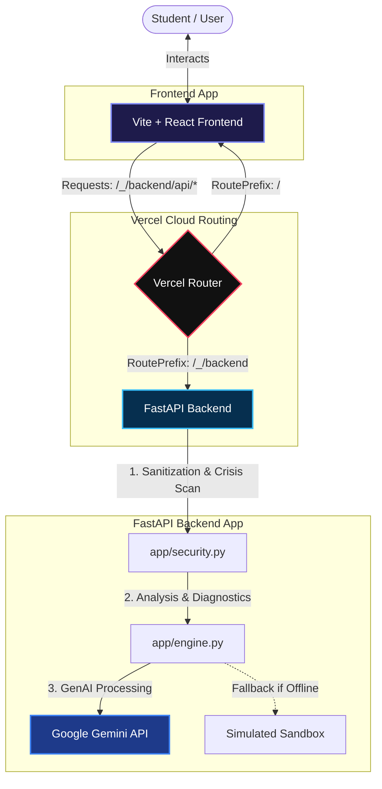

#  MindVane | Student Burnout Tracker & Mental Health Companion

MindVane is a highly responsive, accessible mental health micro-app designed for competitive examination students (JEE, NEET, CAT, GATE, UPSC) to discover hidden academic stress patterns and converse with an empathetic digital companion in real-time.

---

## 📂 Architecture Layout

```
MindVane/
├── backend/                  # Dedicated Python FastAPI Backend Service
│   ├── app/
│   │   ├── __init__.py
│   │   ├── main.py           # FastAPI application entry point & routes
│   │   ├── schemas.py        # Pydantic input/output schemas
│   │   ├── security.py       # HTML sanitization & self-harm keyword scanning
│   │   └── engine.py         # Google GenAI SDK integration & simulated fallbacks
│   ├── tests/
│   │   ├── __init__.py
│   │   └── test_pipeline.py  # Automated Python unit tests (critical)
│   └── requirements.txt      # Python dependencies
│
├── frontend/                 # Vite + React Frontend App
│   ├── dist/                 # Static compiled assets
│   ├── public/               # Static assets & SVG icons
│   ├── src/                  # App components, App.jsx, index.css, main.jsx
│   ├── index.html            # Entry HTML with SEO tags
│   ├── tailwind.config.js    # Neon dark mode configurations
│   ├── vite.config.js        # Vite bundler parameters
│   └── package.json          # React dependencies
│
└── README.md                 # Root instructions layout (this file)
```

### 🗺️ System Architecture & Data Flow



---

## 🛠️ Installation & Setup

### 1. Python FastAPI Backend Service (`backend/`)

Navigate to the backend directory and set up a virtual environment:

```bash
cd backend
python -m venv venv
# Activate virtual environment
# Windows (PowerShell):
.\venv\Scripts\Activate.ps1
# Windows (CMD):
.\venv\Scripts\activate.bat
# Linux/macOS:
source venv/bin/activate

# Install dependencies
pip install -r requirements.txt
```

Run the backend development server:

```bash
uvicorn app.main:app --reload --port 8000
```
The backend API will be available locally at `http://localhost:8000`.

*Note: Set the `GEMINI_API_KEY` environment variable to connect to the live Google Gemini models. If unset, the backend will gracefully run in Sandbox Simulation mode.*

### 2. Vite + React Frontend App (`frontend/`)

Navigate to the frontend directory:

```bash
cd frontend
npm install
npm run dev
```
The frontend application will boot locally at `http://localhost:5173`.

---

## 🧪 Automated Unit Testing (Python)

To verify the endpoints, data schemas, security guardrails, and simulation fallbacks, run `pytest` inside the `backend` directory:

```bash
cd backend
pytest
```

---

## 🌐 Production & Vercel Context Routing

The frontend dynamically detects its runtime environment:
*   In **Local Development** (`localhost`), api requests point to `http://localhost:8000/_/backend/api/...`
*   In **Production** (e.g. Vercel deployment), api requests use relative routes pointing to `/_/backend/api/...`
