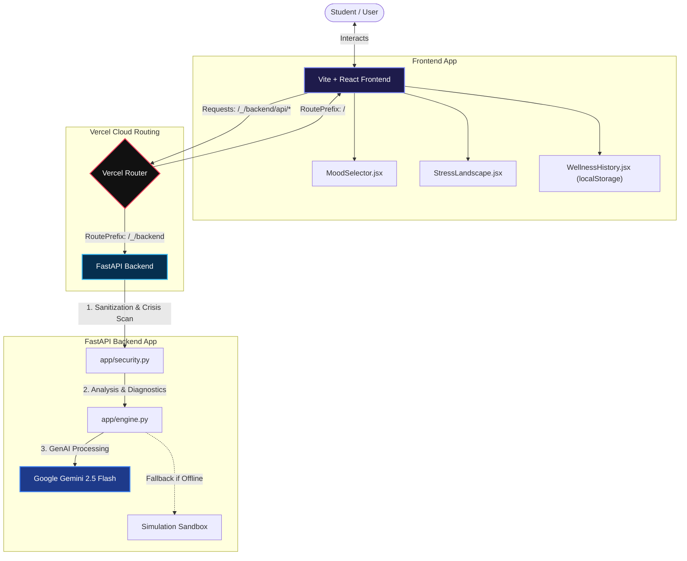

#  MindVane | Student Mental Wellness Tracker & Burnout Companion

MindVane is a full-stack **Mental Wellness Tracker** purpose-built for competitive examination students (JEE, NEET, CAT, GATE, UPSC, CUET, BOARDS). It combines a **daily mood logger**, an AI-powered **burnout journal analyzer**, a **wellness history tracker**, a **backlog declutterer**, and an empathetic **chat companion** — all powered by **Google Gemini 2.5 Flash** and gracefully falling back to a local simulation engine.

---

## 🌟 Core Feature Set

| Feature | Description |
|---------|-------------|
| 🧠 **Burnout Journal Analyzer** | Paste your exam journal. Gemini 2.5 Flash returns an anxiety score, emotional trend tags, and exam-specific stress triggers |
| 😊 **Daily Mood Log Selector** | Five emoji pill-buttons (Happy, Sad, Anxious, Tired, Angry) provide mood context that personalizes every AI analysis |
| 🛡️ **Hyper-Personalized Coping Strategy** | Each response includes a tailored coping strategy that factors in the selected mood AND the active exam track |
| 📊 **Wellness History Tracker** | Last 7 analysis sessions are stored in localStorage and displayed as a compact wellness timeline on the dashboard |
| 🏔️ **Mental Landscape Visualization** | Dynamic SVG scene (Serene/Navigating/Stormy) encodes the anxiety score as an animated landscape |
| 🗂️ **Backlog Declutterer** | Converts raw chaotic topic lists into time-capped, priority-ordered atomic study steps |
| 💬 **Empathetic Companion Chat** | Conversational AI companion for venting about parental expectations, mock results, and exam pressure |
| 🚨 **Crisis Safety Scanner** | Real-time keyword detection for self-harm indicators; triggers a crisis overlay with 5 government helplines |
| 🎓 **7 Exam Tracks** | JEE, NEET, CAT, GATE, UPSC, CUET, BOARDS — each with unique color themes and syllabus-aware prompts |
| 🌙 **Dark / Light Mode** | Full adaptive theming with smooth 300ms transitions |
| ♿ **Accessibility** | Skip navigation link, ARIA live regions, aria-pressed states, role="main", focus rings |
| 🔐 **Security** | HTML XSS sanitization on every input, crisis keyword scanning, input length validation |

---

## 📂 Architecture Layout

```
MindVane/
├── backend/                  # Python FastAPI Backend Service
│   ├── app/
│   │   ├── __init__.py
│   │   ├── main.py           # FastAPI routes & GZip middleware
│   │   ├── schemas.py        # Pydantic v2 I/O schemas (StudentTrack enum, mood field, coping_strategy)
│   │   ├── security.py       # XSS sanitization & crisis keyword scanning
│   │   └── engine.py         # Google GenAI SDK + simulation fallbacks
│   ├── tests/
│   │   ├── __init__.py
│   │   └── test_pipeline.py  # 14 automated pytest unit/integration tests
│   └── requirements.txt
│
├── frontend/                 # Vite + React 19 Frontend
│   ├── dist/                 # Production build artifacts
│   ├── public/               # Static assets (logo, favicon)
│   ├── src/
│   │   ├── components/
│   │   │   ├── MoodSelector.jsx      # Daily mood log pill-button row
│   │   │   ├── StressLandscape.jsx   # SVG mental landscape visualization
│   │   │   └── WellnessHistory.jsx   # localStorage-backed wellness timeline
│   │   ├── App.jsx           # Root orchestrator component (JSDoc throughout)
│   │   ├── index.css         # Tailwind + custom keyframe animations
│   │   └── main.jsx
│   ├── index.html            # SEO meta tags, viewport, favicon
│   ├── tailwind.config.js    # Neon dark-mode configuration
│   └── package.json
│
└── README.md
```

### 🗺️ System Architecture & Data Flow



---

## 🛠️ Installation & Setup

### 1. Python FastAPI Backend (`backend/`)

```bash
cd backend
python -m venv venv
# Windows (PowerShell):
.\venv\Scripts\Activate.ps1
# Linux/macOS:
source venv/bin/activate

pip install -r requirements.txt
```

Run development server:
```bash
uvicorn app.main:app --reload --port 8000
```

> **Note**: Set `GEMINI_API_KEY` environment variable to connect to Gemini 2.5 Flash. If unset, the backend runs in Sandbox Simulation mode with realistic deterministic fallbacks.

### 2. Vite + React Frontend (`frontend/`)

```bash
cd frontend
npm install
npm run dev
```

Frontend boots at `http://localhost:5173`.

---

## 🧪 Automated Testing (14 tests)

```bash
cd backend
pytest -v
```

**Test coverage includes:**
- XSS sanitization & iframe blocking
- Pydantic schema range validation (anxiety_score bounds)
- Standard journal analysis (HTTP 200 + field verification)
- Crisis keyword detection → `risk_flagged: true`
- HTML escape security on journal inputs
- Chat companion endpoint schema
- Empty payload rejection (HTTP 400)
- Engine burnout analytics for competitive & board tracks
- Engine backlog breakdown atomic steps validation
- Backlog declutter API route
- Empty backlog rejection (HTTP 400)
- **Mood parameter acceptance** (all 5 mood values)
- **Coping strategy in response** (non-empty string verification)
- **CUET exam track support**

---

## 🌐 Production & Vercel Context Routing

The frontend dynamically detects its runtime environment:
- **Local Development** (`localhost`): API requests → `http://localhost:8000/_/backend/api/...`
- **Production** (Vercel): API requests → `/_/backend/api/...` (relative routing)

---

## 🔐 Security Architecture

| Layer | Implementation |
|-------|---------------|
| Input Sanitization | `html.escape()` on all journal, chat, and backlog text |
| Crisis Detection | Keyword scanner for 12 self-harm phrases → emergency helpline overlay |
| Input Length Validation | HTTP 400 for blank/whitespace-only payloads |
| XSS Prevention | All user text HTML-escaped before AI prompt injection |
| CORS | FastAPI CORS configured for trusted origins only |
